class: middle, center, title-slide
count: false

# `pyhf`: pure-Python
# implementation of HistFactory
# with autograd

(for the dev team)<br>
Matthew Feickert<br>
[matthew.feickert@cern.ch](mailto:matthew.feickert@cern.ch)

[DIANA/HEP Meeting](https://indico.cern.ch/event/759480/)

October 29th, 2018

---

# Collaborators

<br><br>

<!-- .center[
.circle.width-30[] &nbsp;
.circle.width-30[] &nbsp;

] -->
.grid[
.kol-1-3.center[
<!-- .circle.width-80[] -->
.circle.width-80[]

[Lukas Heinrich](https://github.com/lukasheinrich)

NYU
]
.kol-1-3.center[
.circle.width-80[]

[Giordon Stark](https://github.com/kratsg)

UCSC SCIPP
]
.kol-1-3.center[
<!-- .circle.width-70[] -->
.circle.width-70[]

[Kyle Cranmer](http://theoryandpractice.org/)

NYU
]
]


---
# HistFactory

<br>

- A flexible p.d.f. template to build statistical models from binned distributions and data
<!-- - Developed by Cranmer, et al. [1] -->
- Developed by Cranmer, Lewis, Moneta, Shibata, and Verkerke [1]
- Widely used by the HEP community for standard model measurements and BSM searches
   <!-- - Show public summary plots and link to references that use HistFactory (multi b-jets for example) -->

.kol-1-1.center[
.width-100[]
]

---
# HistFactory Template

<br>

$$\begin{aligned}
&\mathcal{P}\left(n\_{c}, x\_{e}, a\_{p} \middle|\phi\_{p}, \alpha\_{p}, \gamma\_{b} \right) = \\\\
&{\color{blue}{\prod\_{c \\,\in\\, \textrm{channels}} \left[\textrm{Pois}\left(n\_{c} \middle| \nu\_{c}\right) \prod\_{e=1}^{n\_{c}} f\_{c}\left(x\_{e} \middle| \vec{\alpha}\right)\right]}} {\color{red}{G\left(L\_{0} \middle| \lambda, \Delta\_{L}\right) \prod\_{p\\, \in\\, \mathbb{S}+\Gamma} f\_{p}\left(a\_{p} \middle| \alpha\_{p}\right)}}
\end{aligned}$$

.bold[Use:] Multiple disjoint _channels_ (or regions) of binned distributions with multiple _samples_ contributing to each with additional (possibly shared) systematics between sample estimates

.bold[Main pieces:]

- .blue[Poisson p.d.f. for bins observed in all channels]
- .red[Constraint p.d.f. (+ data) for "auxiliary measurements"]
   - encoding systematic uncertainties (normalization, shape, etc)

---
# HistFactory Template

$$\begin{aligned}
&\mathcal{P}\left(n\_{c}, x\_{e}, a\_{p} \middle|\phi\_{p}, \alpha\_{p}, \gamma\_{b} \right) = \\\\
&\prod\_{c \\,\in\\, \textrm{channels}} \left[\textrm{Pois}\left(n\_{c} \middle| \nu\_{c}\right) \prod\_{e=1}^{n\_{c}} f\_{c}\left(x\_{e} \middle| \vec{\alpha}\right)\right] G\left(L\_{0} \middle| \lambda, \Delta\_{L}\right) \prod\_{p\\, \in\\, \mathbb{S}+\Gamma} f\_{p}\left(a\_{p} \middle| \alpha\_{p}\right)
\end{aligned}$$

.bold[This is a _mathematical_ representation!] Nowhere is any software spec defined

Until now, the only implementation of HistFactory has been in RooStats+RooFit

- To start using HistFactory p.d.f.s first have to learn ROOT, RooFit, RooStats
   - Problem for our theory colleagues (generally don't want to)
- Possible issues with scaling I/O and memory for large models
   - Not multithreaded
- Difficult to interface with modern tools for minimization and computation of the p.d.f.
- Likelihood stored in the binary ROOT format
   - Challenge for long-term preservation (i.e. HEPData)
   - Why is a histogram needed for an array of numbers?

---
# `pyhf`: HistFactory in pure Python

- First non-ROOT implementation of the HistFactory p.d.f. template
   - [](https://doi.org/10.5281/zenodo.1169739)
   - pure-Python library
      - [`pip install pyhf`](https://diana-hep.org/pyhf/installation.html#install-from-pypi)
   - machine learning frameworks as computational backends
      - [`pip install pyhf[tensorflow]`](https://diana-hep.org/pyhf/installation.html#with-tensorflow-backend)
- Alternative choice to ROOT-based HistFactory to use in the analysis pipeline of HistFitter + HistFactory + RooStats
   - Project scope: HistFactory
   - Not a replacement for HistFitter or RooStats
- Open source tool for all of HEP
   - Originated from a [DIANA/HEP](https://diana-hep.org/) project fellowship
      - Special thanks to [Gilles Louppe](https://glouppe.github.io/), [Vince Croft](https://www.nikhef.nl/~vcroft/), and [Kyle Cranmer](http://theoryandpractice.org/)
   - Not experiment specific (though designed by ATLAS physicists)
   - Have contributions from [CMS members](https://github.com/diana-hep/pyhf/commit/4159c2dbc9ed7a9b3866e9b127d885d696314754) and [strong interest by theorists](https://indico.cern.ch/event/689514/contributions/2961925/)
   - Used for reinterpretation in phenomenology paper [2]

---
# HistFactory in ROOT Environment

.center.width-100[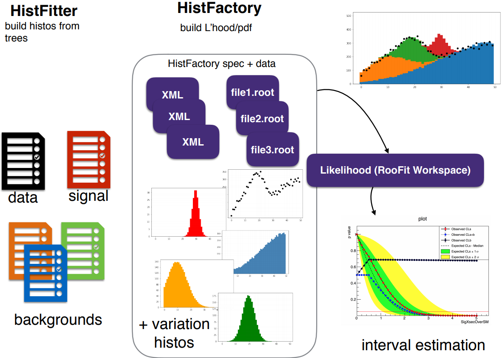]

.footnote[[Image credit: Lukas Heinrich](https://indico.cern.ch/event/754255/contributions/3129528/)]

---
# HistFactory with `pyhf`

.center.width-100[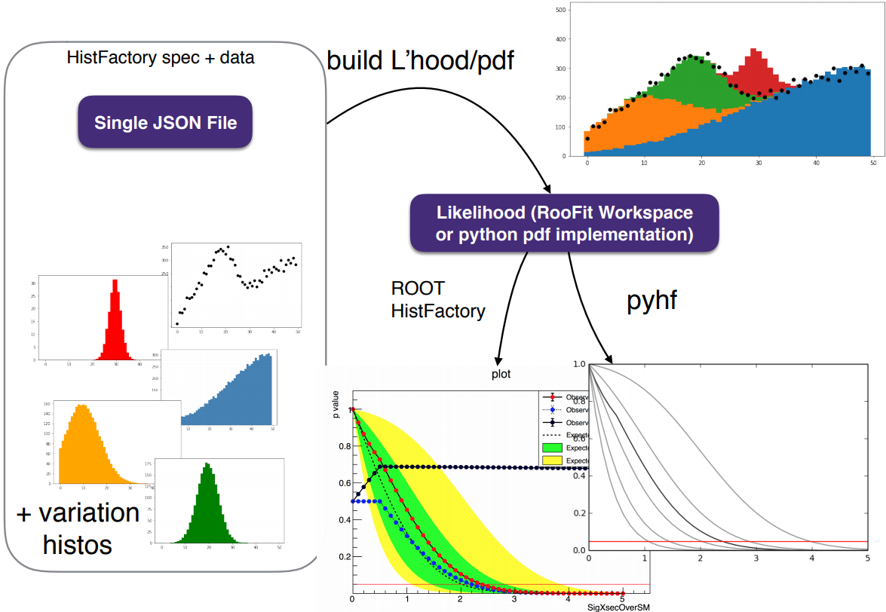]

.footnote[[Image credit: Lukas Heinrich](https://indico.cern.ch/event/754255/contributions/3129528/)]
---

class: middle

.center[Additionally allows for interactive visualization]

<br>

.center.width-100[<iframe width="560" height="315" src="https://www.youtube.com/embed/9egt9ZTm7T0" frameborder="0" allow="autoplay; encrypted-media" allowfullscreen></iframe>]

.footnote[Image credit: Lukas Heinrich]
---
# What does `pyhf` provide?

1\. .bold[Standalone pure-Python HistFactory implementation] including hooks into
modern deep-learning, autodifferentiable tensor libraries

- No ROOT dependency required at all! (Thanks [uproot](https://github.com/scikit-hep/uproot)!)
- implementation of asymptotic interval estimation algorithm based
on profile likelihood test-statistic

2\. .bold[Pure JSON schema] to distribute and archive HistFactory models
ingredients without any reliance on binary formats

.grid[
.kol-1-3.center[
<!-- .width-100[] -->
.width-100[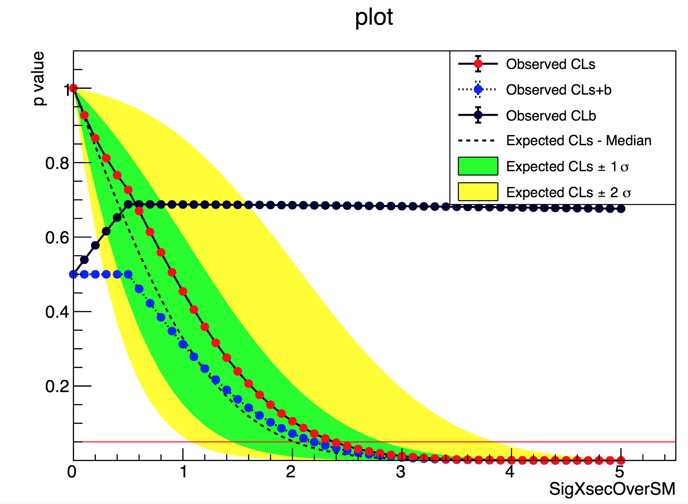]

ROOT
]
.kol-1-3.center[
<!-- .width-100[] -->
.width-100[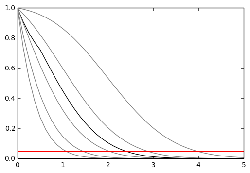]

pyhf
]
.kol-1-3.center[
.width-100[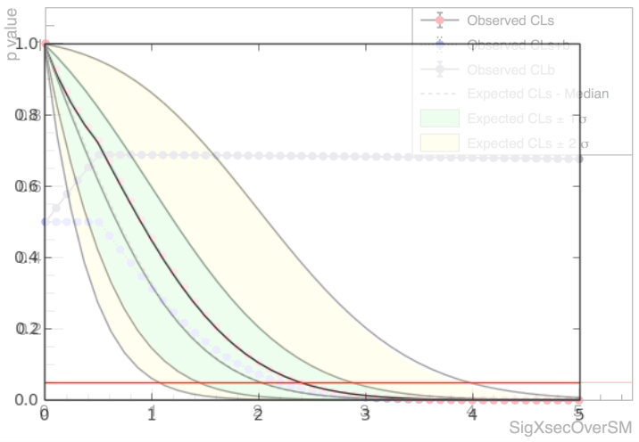]

Same Result
]
]

---

class: middle

- .bold[a useful template for all of HEP]
   - easy to use alternative implementation for non-ROOT software stack
- .bold[open industry standard file formats]
   - JSON will be with us for a long long time
- .bold[hardware acceleration]
   - CPU → GPU with a simple switch
- .bold[machine learning framework backends]
   - Full gradients for minimization
- .bold[path to distributed, cluster-based computation]
   - Coming soon: [Dask](http://dask.pydata.org/en/latest/) backend
- .bold[easy reinterpretation]
- .bold[toy and asymptotic calculations]
   - In now: asymptotics
   - Coming soon: sampling (think [`tfp`](https://github.com/tensorflow/probability))

---

# Machine Learning Frameworks for Computational Backends

.grid[
.kol-2-3[

All numerical operations implemented in .bold[tensor backends] through an API of $n$-dimensional array operations

Allows for switching out the tensor backend with a single call

Using deep learning frameworks as computational backends allows for .bold[exploitation of auto differentiation (autograd) and GPU acceleration]

As huge buy in from industry we benefit for free as these frameworks are .bold[continually improved] by professional software engineers

]
.kol-1-3.center[
<!-- .width-40[] -->
.width-40[]

<br>

<!-- .width-100[] -->
.width-100[]

<br>

<!-- .width-100[] -->
.width-100[]
]
]

---

class: middle

.bold[Automatic differentiation ([autograd](http://www.columbia.edu/~ahd2125/post/2015/12/5/))]

.grid[
.kol-2-3[
With ML backends in `pyhf` gain access to exact (higher order) derivatives of the likelihood during minimization &mdash; accuracy is only limited by floating point precision

$$
\frac{\partial L}{\partial \mu}, \frac{\partial L}{\partial \theta_{i}}
$$

Gain this through the frameworks creating directed computational directed acyclic graphs and then applying the chain rule (to the operations)

.center.width-70[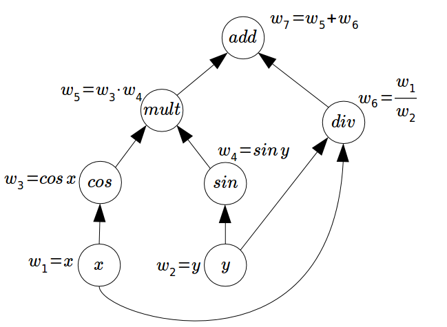]
]
.kol-1-3[
.center.width-125[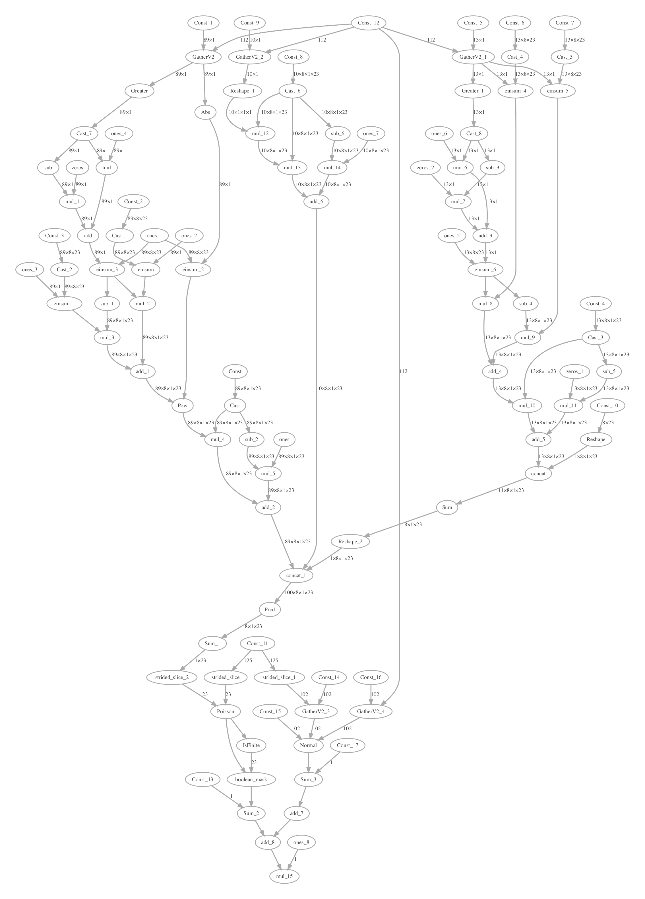]

.center[example `pyhf` DAG section]
]
]

.footnote[[Image credit: Alan Du](http://www.columbia.edu/~ahd2125/post/2015/12/5/)]

---
class: middle

.bold[GPU Acceleration]

- Machine Learning community specializes in making tensor
computations as fast as possible by exploiting GPUs
   - Gains in the GPU backends translate directly to gains within `pyhf`
- Currently benchmarking CPU vs. GPU performance with [SMU's M2 HPC cluster](http://faculty.smu.edu/csc/documentation/about.html)
- First GPU and TPU results running on Google Colab show order of magnitude speedup for interpolators on large models

.center.width-80[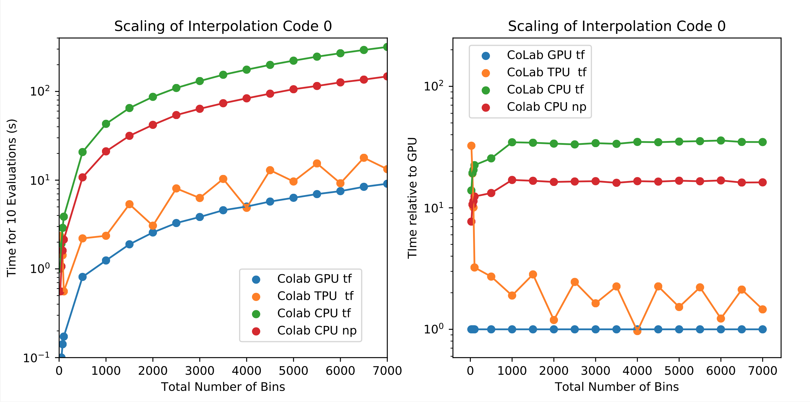]
.center[Single channel with $n$ bins (uncorrelated nuisance parameters).]

<!-- ---

class: middle

.bold[GPU Acceleration]

- Working to add [CuPy backend](https://github.com/cupy/cupy) as compliment of NumPy
- Future work: Support non-NVIDIA GPUs through [OpenCL](https://www.khronos.org/opencl/) -->

---
# JSON for Statistical Models

- Long term support for non-binary format (think .bold[preservation])
   - [HEPData](https://www.hepdata.net/record/ins1634607) now based on [JSON schema](https://www.hepdata.net/record/ins1634607?format=json)
- Language agnostic
   - Reimplement likelihood in a new language more easily (c.f. `pyhf`)
   - JSON contains information to build the HistFactory likelihood
- Human and machine readable
- Offer auto-generation support from existing XML+ROOT configuration
```
$ pyhf xml2json /path/to/config.xml > hf.json
```
- Much smaller size for archiving
   - .bold[Realistic Example:] ATLAS multi b-jet analysis workspace

.grid[
.kol-1-2[

.blue[`pyhf` JSON schema]
```
744K mbj.json
 32K mbj.json.gz
```
]
.kol-1-2[
.red[ROOT]
```
260K config
7.5M data
1.5M results/workspace.root
```
]
]

---
# _Preliminary_ Benchmarking

.grid[
.kol-1-2[

- Changing with many updates
- For a single channel with $n$ nuisance parameters already seeing performance boosts
- For many channels ROOT .bold[was] faster. With latest PRs `pyhf` now faster than ROOT in all cases.
- Needs to be revisited with recent updates that properly .bold[implement vectorization] and graph structure
   - Seeing over a $100x$ speedup to that seen in image for single channel
- Still need to finish benchmarking on GPUs
   - Already see a $10x$ speedup

]
.kol-1-2[
.width-100[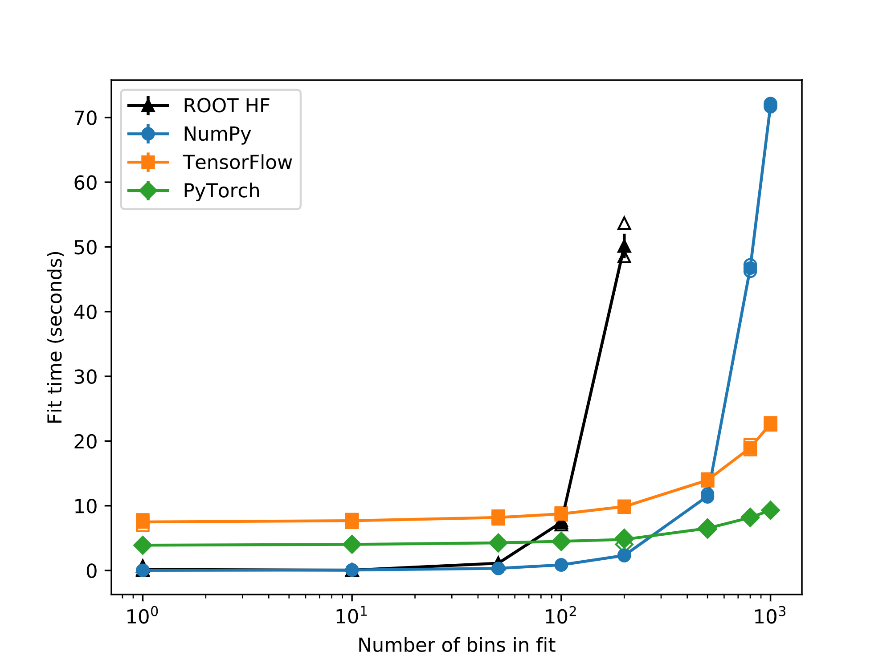]

_old benchmark_: Single channel fit with $n$ bins (uncorrelated nuisance parameters) with CPU backends. Lower is better.
]
]

---
# Realistic Example Use Case

<br>

.blue[CPU NumPy backend of `pyhf`] vs. .red[ROOT HistFactory] on ATLAS multi b-jet Analysis
  - multi b-jet `HistFitter` configuration has 23 Channels

<br>

```
$ time pyhf cls mbj.json | jq .CLs_obs
0.2614638795780821
```
.blue[`16.32s user 0.93s system 95% cpu 18.152 total`]

```
$ time root_cls.py atlas-conf-2018-041/workspace.root | jq .CLs_obs
0.25606989834647437
```
.red[`40.01s user 1.38s system 86% cpu 47.978 total`]

---
# Use in Reinterpretation

.center.width-90[[](https://inspirehep.net/record/1698425)]

.center.width-90[[](https://arxiv.org/pdf/1810.05648.pdf#page=21)]
.center.width-40[[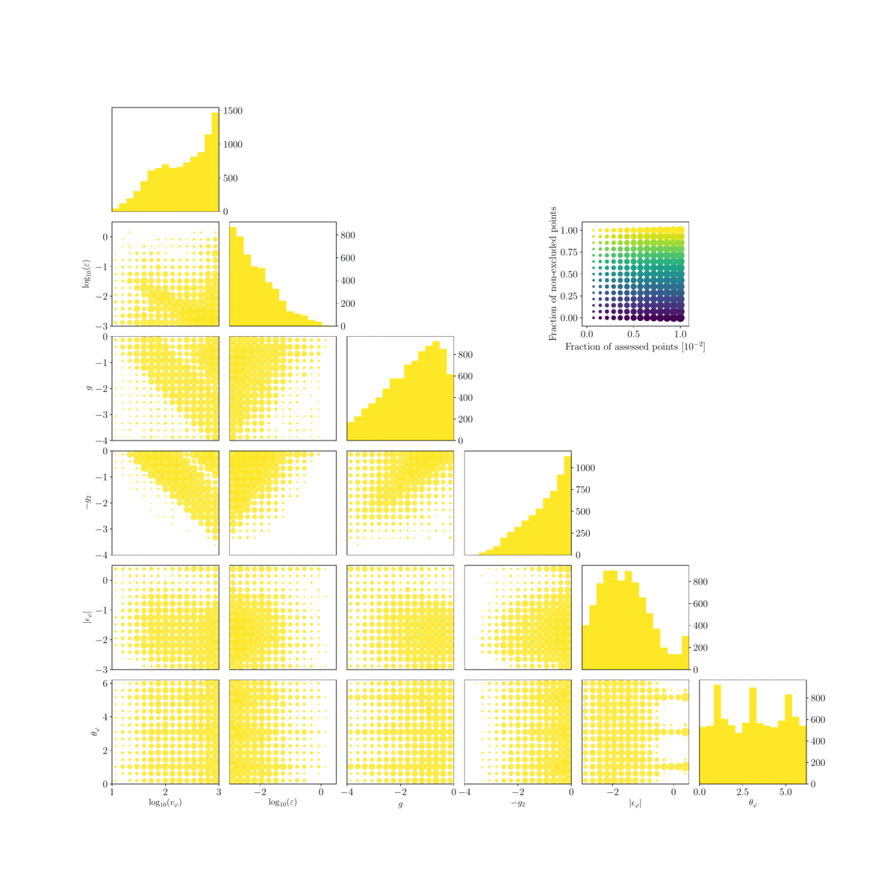](https://twitter.com/lukasheinrich_/status/1052142936803160065)]

---
# Enough talk...live demo time!

<br><br>

.center.bold[Just click the button!]<br><br><br>

.center.width-70[[](https://mybinder.org/v2/gh/diana-hep/pyhf/talk/DIANA-HEP-talk?filepath=docs%2Fexamples%2Fnotebooks%2Ftalks%2FDIANA-HEP-Demo.ipynb)]

---
# [Hello World, `pyhf` style](https://diana-hep.org/pyhf/examples/notebooks/hello-world.html)

<br>

.bold[Two bin counting experiment with a background uncertainty]

```python
>>> import pyhf
>>> import pyhf.simplemodels
>>> import pyhf.utils
>>>
>>> pdf = pyhf.simplemodels.hepdata_like(signal_data=[12.0, 11.0],
                                         bkg_data=[50.0, 52.0],
                                         bkg_uncerts=[3.0, 7.0])
>>> CLs_obs, CLs_exp = pyhf.utils.hypotest(
        1.0, [51, 48] + pdf.config.auxdata, pdf,
        return_expected=True)
>>> print('Observed: {}, Expected: {}'.format(CLs_obs, CLs_exp))
Observed: [0.05290116], Expected: [0.06445521]
```

---
# $CL_{s}$ Example using `pyhf` CLI

<a href="https://carbon.now.sh/?bg=rgba(255%2C255%2C255%2C1)&t=seti&wt=none&l=application%2Fjson&ds=true&dsyoff=20px&dsblur=68px&wc=true&wa=true&pv=48px&ph=32px&ln=false&fm=Hack&fs=14px&lh=133%25&si=false&code=%257B%250A%2520%2520%2520%2520%2522channels%2522%253A%2520%255B%257B%250A%2520%2520%2520%2520%2520%2520%2520%2520%2522name%2522%253A%2520%2522singlechannel%2522%252C%250A%2520%2520%2520%2520%2520%2520%2520%2520%2522samples%2522%253A%2520%255B%257B%250A%2520%2520%2520%2520%2520%2520%2520%2520%2520%2520%2520%2520%2520%2520%2520%2520%2522name%2522%253A%2520%2522sig%2522%252C%250A%2520%2520%2520%2520%2520%2520%2520%2520%2520%2520%2520%2520%2520%2520%2520%2520%2522data%2522%253A%2520%255B12.0%252C%252011.0%255D%252C%250A%2520%2520%2520%2520%2520%2520%2520%2520%2520%2520%2520%2520%2520%2520%2520%2520%2522modifiers%2522%253A%2520%255B%257B%2520%2522name%2522%253A%2520%2522mu%2522%252C%2520%2522data%2522%253A%2520null%252C%2520%2522type%2522%253A%2520%2522normfactor%2522%2520%257D%255D%250A%2520%2520%2520%2520%2520%2520%2520%2520%2520%2520%2520%2520%257D%252C%250A%2520%2520%2520%2520%2520%2520%2520%2520%2520%2520%2520%2520%257B%250A%2520%2520%2520%2520%2520%2520%2520%2520%2520%2520%2520%2520%2520%2520%2520%2520%2522name%2522%253A%2520%2522bkg%2522%252C%250A%2520%2520%2520%2520%2520%2520%2520%2520%2520%2520%2520%2520%2520%2520%2520%2520%2522data%2522%253A%2520%255B50.0%252C%252052.0%255D%252C%250A%2520%2520%2520%2520%2520%2520%2520%2520%2520%2520%2520%2520%2520%2520%2520%2520%2522modifiers%2522%253A%2520%255B%257B%2520%2522name%2522%253A%2520%2522uncorr_bkguncrt%2522%252C%2520%2522data%2522%253A%2520%255B3.0%252C%25207.0%255D%252C%2520%2522type%2522%253A%2520%2522shapesys%2522%2520%257D%255D%250A%2520%2520%2520%2520%2520%2520%2520%2520%2520%2520%2520%2520%257D%250A%2520%2520%2520%2520%2520%2520%2520%2520%255D%250A%2520%2520%2520%2520%257D%255D%252C%250A%2520%2520%2520%2520%2522data%2522%253A%2520%257B%250A%2520%2520%2520%2520%2520%2520%2520%2520%2522singlechannel%2522%253A%2520%255B51.0%252C%252048.0%255D%250A%2520%2520%2520%2520%257D%252C%250A%2520%2520%2520%2520%2522toplvl%2522%253A%2520%257B%250A%2520%2520%2520%2520%2520%2520%2520%2520%2522measurements%2522%253A%2520%255B%257B%250A%2520%2520%2520%2520%2520%2520%2520%2520%2520%2520%2520%2520%2522config%2522%253A%2520%257B%2520%2522poi%2522%253A%2520%2522mu%2522%2520%257D%252C%250A%2520%2520%2520%2520%2520%2520%2520%2520%2520%2520%2520%2520%2522name%2522%253A%2520%2522singlechannel%2522%250A%2520%2520%2520%2520%2520%2520%2520%2520%257D%255D%250A%2520%2520%2520%2520%257D%250A%257D&es=2x&wm=false&ts=false">`JSON` defining a single channel, two bin counting experiment with systematics</a>

.center.width-100[]

---
# $CL_{s}$ Example using `pyhf` CLI

<br>

```
$ pyhf cls demo.json
{
    "CLs_exp": [
        0.002606408505279359,
        0.013820656047622592,
        0.0644552079856191,
        0.23526102499555396,
        0.573041803728844
    ],
    "CLs_obs": 0.05290116065118097
}
```

---
# $CL_{s}$ with Reinterpretation

.bold[Original]

```
$ pyhf cls demo.json | jq .CLs_obs
0.05290116065118097
```

.bold[Consider a new signal to test]

```json
# new_signal.json
[{
    "op": "replace",
    "path": "/channels/0/samples/0/data",
    "value": [5.0, 6.0]
}]
```

.bold[Apply the patch with the new signal to update the likelihood]: $L \to L'$
```
$ pyhf cls demo.json --patch new_signal.json | jq .CLs_obs
0.3401578753020146
```

---
# Development

<br>

.center.width-100[[](https://github.com/diana-hep/pyhf)]

<!-- <br> -->

.grid[
.kol-1-2[

- Openly [developed on GitHub](https://github.com/diana-hep/pyhf)
- Looking for more users
- [Contributions welcome](https://github.com/diana-hep/pyhf/blob/master/CONTRIBUTING.md)!
   - Just a PR away 😉

]
.kol-1-2[
.width-100[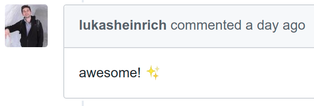]
]
]
Upcoming:
- Finish vectorization and GPU support
- Add a bridge that wraps the `pyhf` p.d.f. as a `RooAbsPdf`

---
# Summary

- Developed the first non-ROOT implementation of the HistFactory p.d.f. template
   - Core in pure Python: utilizing standard NumPy and SciPy stack
   - Deep learning frameworks for computational backends to leverage native autograd and GPU acceleration
   - Simple but powerful Pythonic API
- JSON specification
   - Fully describe model with single simple text based (versionable) file
   - Human and machine readable
   - Robust long long term support
- In the process of validating against ATLAS results
   - multi b-jet analysis and others
- Contributions welcome
   - [GitHub](https://github.com/diana-hep/pyhf)
   - [Documentation](https://diana-hep.org/pyhf/)

---
class: end-slide, center

Backup

---
# Will `pyhf` extend to unbinned models?

<br>

- The project scope is to implement HistFactory as best as possible. While implementing unbinned models is not an impossibility, it is not in the project goals at the current time.
- There are already projects like [GooFit](https://github.com/GooFit/GooFit), which nicely handle unbinned models.
   - "... massively parallel fitter for OpenMP and CUDA for C++ and Python"
   - [](https://zenodo.org/badge/latestdoi/9017446)
- While [contributions are welcome](https://github.com/diana-hep/pyhf/blob/master/CONTRIBUTING.md), it might be worth starting a different project or contributing to projects already focused on unbinned models.

---
# The JSON has both the modifiers and the data. Is this a good idea?

<br>

- The `pyhf` dev team views this as a good feature, not a bug.
- However, the `pyhf` dev team is considering using parts of [`histbook`](https://github.com/scikit-hep/histbook) in the future, leading to some separation.
   - [](https://doi.org/10.5281/zenodo.1321926)

---
# References

1. ROOT collaboration, K. Cranmer, G. Lewis, L. Moneta, A. Shibata and W. Verkerke, .italic[[HistFactory: A tool for creating statistical models for use with RooFit and RooStats](http://inspirehep.net/record/1236448)], 2012.
2. L. Heinrich, H. Schulz, J. Turner and Y. Zhou, .italic[[Constraining $A_{4}$ Leptonic Flavour Model Parameters at Colliders and Beyond](https://inspirehep.net/record/1698425)], 2018.

---

class: end-slide, center
count: false

The end.
